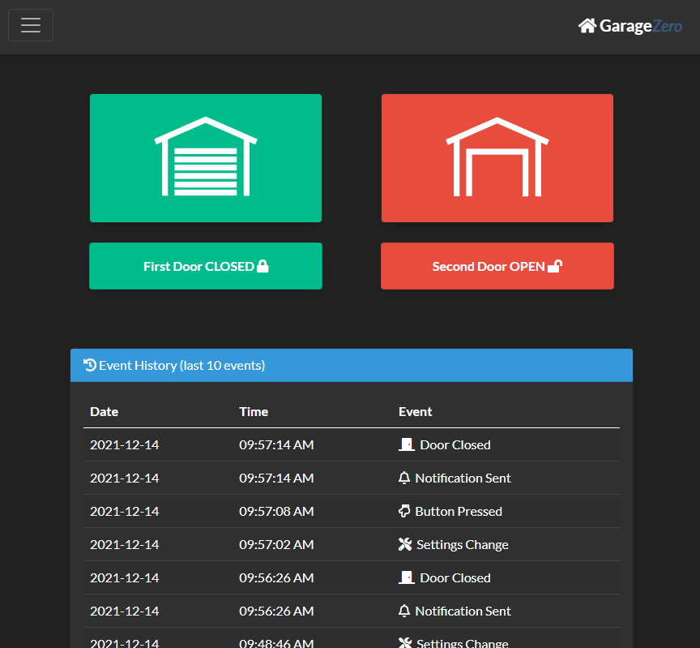
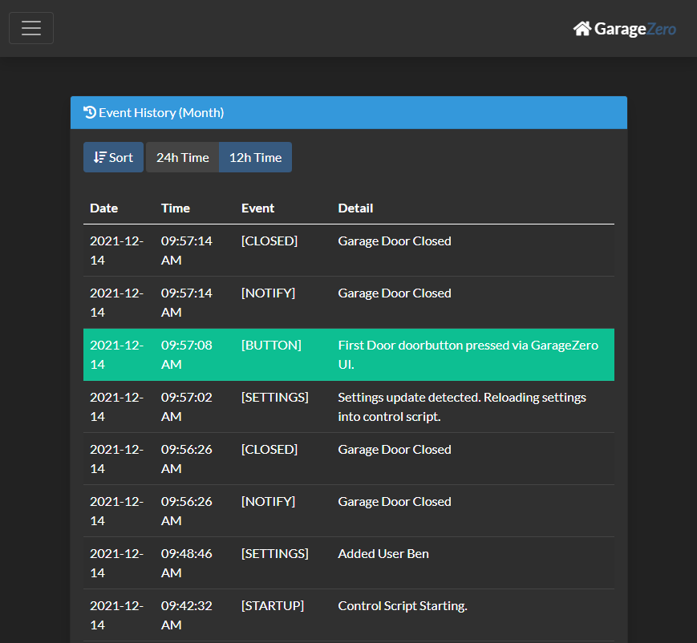
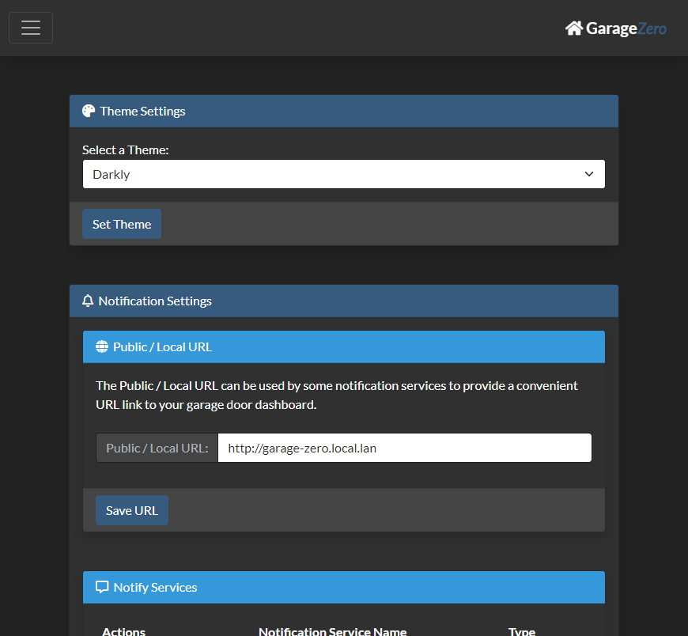
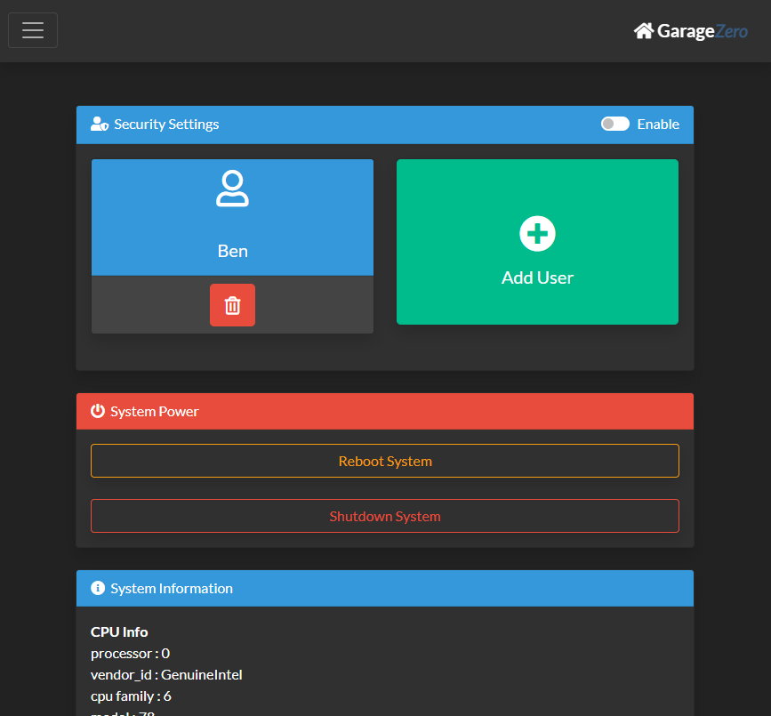

#  Garage-Zero v2

## Raspberry Pi Zero based Garage Door Control & Status

***Note:*** *This project is continuously evolving, and thus this readme will likely be improved over time, as I find the inspiration to make adjustments.  That being said, I'm sure there will be many errors that I have overlooked or sections that I haven't updated.*

## Introduction

Garage Zero v2 is an evolution of the Garage Zero project which aims to provide a smart device accessible garage door controller.  This project provides a UI for controlling garage doors and can even notify you of events. This version has it's own custom PCB hardware design.  

This project utilizes a Raspberry Pi Zero W (or even the new Pi Zero W 2!), plugged into a custom PCB with high power relays to control your garage door, and with sensors for detecting if the garage door is open or closed. 

## Features

- Easy Software Installation
- Supports multiple garage doors (limit is the number of GPIOs)
	- PCB Design Supports Controlling Two Garage Doors, with up to four sensors
- Sensors for door open and door closed
- Notifications are extensible, but support notify on: 
	- When Opened
	- When Closed 
	- When Open for X Time
	- Reminders When Open for X+Y Time 
- Notification System Supports:
	- E-Mail
	- Pushover 
	- Push Bullet
	- IFTTT
- Passcode Security
	- Supporting multiple users + guest codes
	- Passcodes are stored as hashes using bcrypt
- Themes
	- Supports bootstrap css themeing and includes themes from [bootswatch.com](https://bootswatch.com/)
- API
	- Intended to integrate with Home Assistant cover support

## Screenshots

The interface / webui is broken out into four main pages. The first is the dashboard view where you can check the current status of the garage door (whether it is open or closed), see the event history (button presses, opened/closed, notifications, reboots, etc.), and of course a large button(s) to open/close the door (which also indicates green if closed, red if open and if you have two sensors, yellow for opening).



Pressing the hamburger icon in the upper left of the interface, allows you to go to the history page, which gives you the detailed history of the last month of events.  



Pressing the hamburger icon in the upper left of the interface, also allows you to also access to the settings screen. This interface allows you to configure themes, notifications notification settings (i.e. e-mail, IFTTT notifications, and Pushover notifications), door configuration, etc.



Pressing the hamburger icon in the upper left of the interface, also allows you to also access to the admin screen.  From this interface youc can configure security settings, enabling passcode access and setting up different users.  

Scrolling down further gives you the option to reboot the system or shutdown the system.  




## Full Documentation

For more information about how you too can build this project, go to the GitHub pages here: [https://nebhead.github.io/garage-zero-v2](https://nebhead.github.io/garage-zero-v2) 

## Credits

Web Application created by Ben Parmeter, copyright 2022. Check out my other projects on [github](https://github.com/nebhead). If you enjoy this software & hardware and feel the need to donate a cup of coffee, a frosty beer or a bottle of wine to the developer you can click [here](https://paypal.me/benparmeter).

Of course, none of this project would be available without the wonderful and amazing folks below.  If I forgot anyone please don't hesitate to let me know.  

* **Bootstrap** - WebUI Based on Bootstrap 5.  Bootstrap is released under the MIT license and is copyright 2018 Twitter. [getbootstrap.com](http://getbootstrap.com)

* **JQuery** - Required by Bootstrap. Copyright JS Foundation and other contributors. Released under MIT license. [jquery.org/license](https://jquery.org/license/)

* **Popper** - Required by Bootstrap. Copyright 2016, 2018 FEDERICO ZIVOLO & CONTRIBUTORS. Released under MIT license. [popper.js.org](https://popper.js.org/)

* **FontAwesome** - Amazing FREE Icons that I use throughout this project.  Copyright Font Awesome.  Released under the Font Awesome Free License. [fontawesome.com](https://fontawesome.com/) [github.com](https://github.com/FortAwesome/Font-Awesome)

* **Bootswatch** - Excellent free themes for Bootstrap.  Released under MIT License.  Available over at [bootswatch.com](bootswatch.com). 

## Licensing

This project is licensed under the MIT license.

```
MIT License

Copyright (c) 2022 Ben Parmeter and Contributors

Permission is hereby granted, free of charge, to any person obtaining a copy
of this software and associated documentation files (the "Software"), to deal
in the Software without restriction, including without limitation the rights
to use, copy, modify, merge, publish, distribute, sublicense, and/or sell
copies of the Software, and to permit persons to whom the Software is
furnished to do so, subject to the following conditions:

The above copyright notice and this permission notice shall be included in all
copies or substantial portions of the Software.

THE SOFTWARE IS PROVIDED "AS IS", WITHOUT WARRANTY OF ANY KIND, EXPRESS OR
IMPLIED, INCLUDING BUT NOT LIMITED TO THE WARRANTIES OF MERCHANTABILITY,
FITNESS FOR A PARTICULAR PURPOSE AND NONINFRINGEMENT. IN NO EVENT SHALL THE
AUTHORS OR COPYRIGHT HOLDERS BE LIABLE FOR ANY CLAIM, DAMAGES OR OTHER
LIABILITY, WHETHER IN AN ACTION OF CONTRACT, TORT OR OTHERWISE, ARISING FROM,
OUT OF OR IN CONNECTION WITH THE SOFTWARE OR THE USE OR OTHER DEALINGS IN THE
SOFTWARE.
```