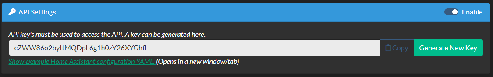

## Home Assistant Setup 

Integrating this project into Home Assistant can seem a little daunting, but it's really not that bad.  

On the 'Admin' tab of the webui, you'll need to enable the API and generate an API key.  Once this is done, there will be a link in this section of the API to provide example yaml code that can be used to plug into your `configuration.yaml` file of Home Assistant.  This link actually provides you with a file that should be populated with the correct resource URL populated with your generated API key.  



Here is an example of what this will look like: 

```yaml
# Sensor garage_door
sensor garage_door:
  - platform: rest
    scan_interval: 30
    resource: http://192.168.10.41/api/abcdefghijklmnopqrstuvwxyz1234567
    name: "Garage Door"
    value_template: "{{ value_json['Garage Door']['status']['limitsensorclosed'] }}"

# Switch garage_door 
switch garage_door:
  - platform: rest
    name: "Garage Door"
    resource: http://192.168.10.41/api/abcdefghijklmnopqrstuvwxyz1234567
    scan_interval: 30
    body_on: '{"DoorButton" : "Garage Door"}'
    body_off: '{"DoorButton" : "Garage Door"}'
    is_on_template: "{{ value_json['Garage Door']['status']['limitsensorclosed'] }}"
    headers:
      Content-Type: application/json
    verify_ssl: false

# Cover Template Example from:  https://www.home-assistant.io/integrations/cover.template/
cover garagedoor:
  - platform: template
    covers:
      garage_door:
        device_class: garage
        friendly_name: "Garage Door"
        value_template: "{{ states('sensor.garage_door') }}"
        open_cover:
          - service: switch.turn_on
            target:
              entity_id: switch.garage_door
        close_cover:
          - service: >- 
              
                switch.turn_off
              
            target:
              entity_id: switch.garage_door
        stop_cover:
          - service: >- 
              
                switch.turn_on
              
            target:
              entity_id: switch.garage_door
        icon_template: >-
          
            mdi:garage-open
          
            mdi:garage
          
```

Once configured, you can add these entities to your dashboard configuration.  It also means that you can use Google Assistant or Amazon Echo (if setup in HA) to get the door status, open and close the door.  And that's something, right?  