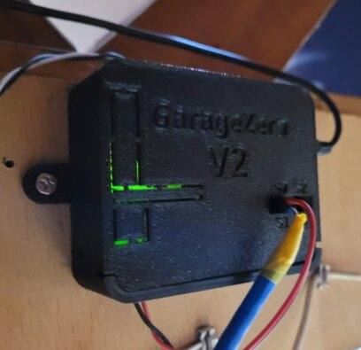

## Hardware Configuration

This project now uses a custom PCB design and 3D printed case (or case of your choice), however there shouldn't be anything stopping you from manually wiring up a relay module to this project and putting it into project case of your design.

### PCB Design

The PCB for this project is designed for a two door system, but can easily be used for a single door system.  In fact, I only have a single door at my home currently and had only designed this for two doors to satisfy a wider range of users.  

This design integrates the relays into the project such that no additional relay modules are necessary.  Everything is neatly integrated, and fits nicely into an enclosure.  The drawback to this design is that it does require you to source the all of the discrete components, which can be a bit of a challenge and drive up cost.  Also, if you are not comfortable with soldering then this might be a challenge for you.  

**PCB & Schematic for w/Relays:** [Link to Design on OSHWLab](https://oshwlab.com/nebhead77/garage-zero)

- Boards can be directly ordered from EasyEDA & JLCPCB usually very inexpensively.  Simply click the above links, open the PCB in EasyEDA (while logged into your account), then click on Fabrication in the menu and PCB Fabrication File (Gerber).  You should have the option to order directly there. 
- If I have any spare boards, I will have them available to order on [my Tindie Store here](https://www.tindie.com/stores/nebhead/). 

### The Parts List

The following is a high level parts list:

* **Raspberry Pi Zero W** - Technically any Raspberry Pi will do fine, but for this application a Raspberry Pi Zero W works really well and is the right price.  The newly released Pi Zero 2 W should also work great, boot faster and have more general snappiness. 
* **SRD-05VDC-SL-C Relays** - The star of the show is this relay which is a good, high-power, mechanical relay.  These relays are very commonly found on standard relay modules can be readily found on many different websites. [Amazon Link](https://smile.amazon.com/gp/product/B07MJJYRQJ) 
* **Resistors** - An assortment of 10k Ohm and 1k Ohm radial resistors for the PCB with relays.  
* **LED** - Again, these are personal preference, or whatever you might have laying around the house.  My LED is very bright and I have decided to go with a beefier resistor to dim it more. For the 3D printed design, you may want to utilize a 3mm LED. 
* **BC547 Transistors** - I used the BC547 transistor to help with switching the 5V supply to the relay.  [Amazon Link](https://smile.amazon.com/gp/product/B06Y4M2N29)
* **PC817 Optoisolator** - I use these surface mount optoisolators for switching the relay on/off.  [Amazon Link](https://smile.amazon.com/gp/product/B07FJ76X42)
* **1N4007 Diodes** - I use these diodes to prevent flyback voltage accross the inputs to the relay.  [Amazon Link](https://smile.amazon.com/gp/product/B07Q5FZR7X) 
* **Screw Terminals** - 5mm pitch screw terminals are used to attach wires to the button terminals on your garage door.  [Amazon Link](https://smile.amazon.com/gp/product/B01F7KOM10)
* **Micro SD Card** - Greater than 4GB is required for Raspbery Pi OS Lite. 
* **MicroUSB Power Adapter** - At least 1 amp current recommended.
* **USB Power PCB** - These little boards are great for adding power-input to your project.  Power is routed via this connector through the PCB to the rest of the components.  [Amazon Link](https://smile.amazon.com/gp/product/B07W844N43)
* **Self Latching Button** - Can be used for the power switch (this is optional - but if omitted, requires the power switch header to be jumpered).  Currently the 3D printed design does not support this. [Amazon Link](https://smile.amazon.com/gp/product/B075VBV4QH)
* **Raspberry Pi Header** - 40 Pin header for the Raspberry Pi.  [Amazon Link](https://smile.amazon.com/gp/product/B00R1LLM1M)
* **Various 2.54mm Pitch Headers** (optional) - Needed for connecting button boards, etc. [Amazon Link](https://smile.amazon.com/gp/product/B01FWC53C0)
* **MC-38 Wired Door Window Sensor Magnetic Switch** - At least one door sensor is required for detecting the door state.  The door can be configured to have two sensors so that open and closed states can be indicated.  [Amazon Link](https://smile.amazon.com/gp/product/B0154PTDFI)

### Hardware Setup

Since it's usually easiest to just look at the pictures and understand how this is built out, I'm just going to spam a bunch of images here and hopefully this will help. 

Pictured here is the front side of the Garage Zero v2 PCB (nearly) fully populated with components and headers.  Note that in the upper right is the small USB breakout board.  This does not need to be mounted directly to the board, but can be connected via a header.  However, the for the 3D printed case design, it does assume the power connector is soldered to the board.  

The below photo shows the Raspberry Pi installed into the header of the PCB.  This also shows the PCB inside the 3D printed case.  Note, you can see that there is a jumper installed across the power-switch header since there is no power-switch populated on this version.  

This shows the backside of the PCB.  

The next picture shows the MC-38 Wired Door Window Sensor Magnetic Switch, with male dupont connectors which can be used to plug directly into the header of the PCB sensors.  

The below is the installed case / garagezero system, located above the garage door opener.  Note that there are two wires coming out of the relay connections on the bottom, going to the garage door opener's button terminals.  The sensor wires are coming from the top side of the case.  In my setup, I have a short length of Dupont wires connected to the door open sensor, and a converted network cable (with dupont connectors) that stretches to the door closed sensor near the door itself.  

This shows the network cable (fastened to the top of the rail with 3d-printed clips) connects the door closed sensor.  

This shows the door closed sensor which is mounted on the rail, with the magnet mounted on the sled/trolley (Genie brand).   

The below is the door open sensor which is mounted closer to the garage door opener at the 'end stop' of the sled/trolley.  The sled/trolley has the magnet mounted on both sides of the rail as we have these sensors mounted on opposite sides.  

Below is another angle of the Garage Zero v2 mounted above the garage door opener, with sensor wires extending to the sensors.  

### 3D Printable Enclosure

A 3D printable version of the enclosure is available for anyone interested.  This has gone through a couple of iterations and finally landed on this design.  

- [OnShape Designs](https://cad.onshape.com/documents/f80cc30e1b277584eb57dd0f/w/1093b40ac88cbfb8a2744eae/e/6e01dea3d88c1ddb7e1787a2?renderMode=0&uiState=622017d9ad82106838c1e764) - Here you will find the design files that can be exported to STL and can also be cloned and tweaked for your needs.  The pieces of the file marked v2 are the most recent design.

- [Thingiverse STLs](https://www.thingiverse.com/thing:5272065) - I've posted the STL files for the v2 here on Thingiverse so that you can print these directly yourself. 

### Case Assembly

The case assembly is extremely simple and really only consists of two pieces.  The base and the lid.  The lid slides down some rails from the top/back of the base.  The lid features some cutouts if additional connections are needed for extended features in the future.  There are screw mounts on either side for screws to mount into the ceiling or beams.  

The below shows the lid being slid onto the base.  If mounted in the upright position, gravity holds the lid shut on the base.  

This shows the back side of the case which is has the mounting screws flush with the bottom of the case.  The nuts for these screws are actually mounted inside the case.  

Also included, but not pictured here, are mounting brackets for the sensors that ar compatible with Genie brand rails/sleds/trolleys.  There are also clips that can be printed to attach the network cable to the top of the rail.  All of these can be remixed/adapted for other garage door opener brands and the above OnShape link is shared for anyone who might want to do that.  