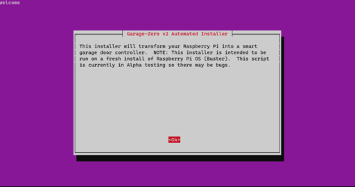
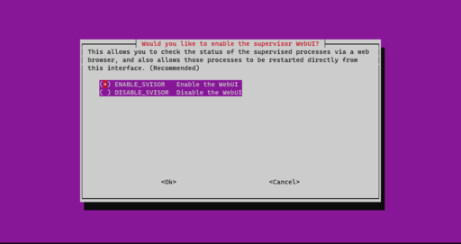
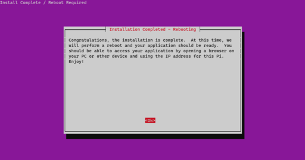

## Software Installation

### Raspberry Pi Zero Setup Headless (*from raspberrypi.org*)

Once you've burned/etched the Raspbian Stretch Lite image onto the microSD card, connect the card to your working PC and you'll see the card being mounted as "boot". Inside this "boot" directory, you need to make 2 new files. You can create the files using Atom code editor.

+ Step 1: Create an empty file. You can use Notepad on Windows or TextEdit to do so by creating a new file. Just name the file `ssh`. Save that empty file and dump it into boot partition (microSD).

+ Step 2: Create another file name wpa_supplicant.conf . This time you need to write a few lines of text for this file. For this file, you need to use the FULL VERSION of `wpa_supplicant.conf`. Meaning you must have the 3 lines of data namely country, ctrl_interface and update_config

```bash
country=US
ctrl_interface=DIR=/var/run/wpa_supplicant GROUP=netdev
update_config=1

network={
    ssid="your_real_wifi_ssid"
    scan_ssid=1
    psk="your_real_password"
    key_mgmt=WPA-PSK
}
```

#### Run RasPi-Config
```bash
$ ssh pi@192.168.10.xxx

$ sudo raspi-config
```
In these menus you should setup up the following: 
+ Set locales
+ Set timezone
+ Replace Hostname with a unique hostname ('i.e. spkr-select')
+ Change password (IMPORTANT: It is a known security risk to keep the password at default of 'raspberry')

Finish and reboot.  

### Automatic Software Installation

After you've done the above steps to configure your Raspberry Pi initially, you will need to log in via SSH and at the command line type the following:

```bash
curl https://raw.githubusercontent.com/nebhead/garage-zero-v2/main/auto-install/install.sh | bash
```

```note
If installing manually, do not use SUDO, as it will cause issues.  
```

Follow the onscreen prompts to complete the installation. 



Select wether you would like the supervisor deamon web interface (strongly recommended) and select a username/password.



You're finished!  Once the system reboots, you should be up and running.  

